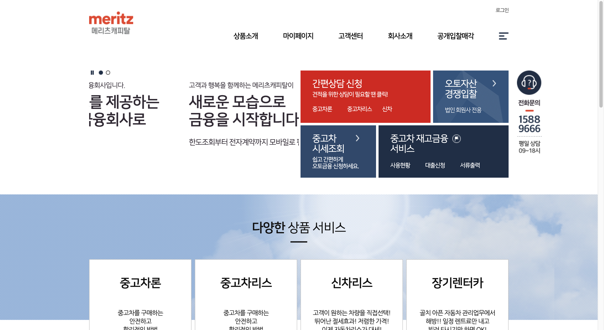

# Portfolio

# 프로필
### 김동희(KIM DONGHEE) 
생년월일 : 1992년 2월 16일  
성별 : 여 
주소 : 서울시 동작구 흑석동 208-2  
연락처 : 010-8538-6646  
E-MAIL : dhk8538@gmail.com
  

# 경력
* 2022.01 ~ 매디브 / uiux팀 과장
* 2021.08 ~ 2021.12 매디브 / 프리랜서
* 2021.05 ~ 2021.07 리앙에이지 / 프리랜서
* 2019.11 ~ 2021.04 리앙에이지 / ui개발팀 대리
* 2019.06 ~ 2019.09 이니셔티브식스 / ui개발팀 대리
* 2017.08 ~ 2018.08 아이엠폼 / 뉴미디어사업팀 대리
* 2017.01 ~ 2017.07 나모웹비즈 / 대리
* 2015.01 ~ 2016.12 위밋 / Dev2팀 사원
* 2013.03 ~ 2014.12 비브이에스 / 제작3팀 사원
* 2012.09 ~ 2013.03 DBK / 프리랜서

  
# 기술
html5 표준 마크업 및 css, sass, scss, jQuery, JavaScript, vue 가능 
크로스브라우징, 반응형 웹, (멀티 디바이스) 작업 가능 
웹접근성 마크 획득 경험 다수 
Git, svn, webpack 사용 소스형상관리 가능  
wiki, jira 협업도구 사용 경험 

  
# 프로젝트 
## 이마트 피코크/데이즈 사이트 구축 (2019.11 ~ 2019.03) 
 
## 우리은행 태블릿 브렌치 고도화 (2020.04 ~ 2020.05) 

* * *
## 롯데면세점 운영 (2020.06 ~ 2021.04) 
메인개편 작업

* * *
## 메리츠캐피탈 중고차 대출 구축 (웹, 모발일, 앱) (2019.07 ~ 2019.09) 
<figure class="half">
 
 

</figure>

- Web, Mobile 단위작업 (마이페이지, 고객센터 메뉴)
- Web sub Jquery
- slick을 이용한 slide 작업
- 시멘틱 테그를 이용한 약관 작업
  
* * *
## 한화 갤러리아 커뮤니케이션 채널통합 관리자페이지 (2019.06 ~ 2019.07) 
- Markup 단위 작업
  
* * *
## 청와대 홈페이지 운영 (2012. 09 ~ 2018. 08) 
 
- 청와대 홈페이지, 관람 페이지 개편 (PC Web, Mobile Web) 및 운영 
- 시즌별 마이크로사이트 제작 
- 특수크로스브라우징 (IE7, IE8) 
- 접근성 마크획득 

