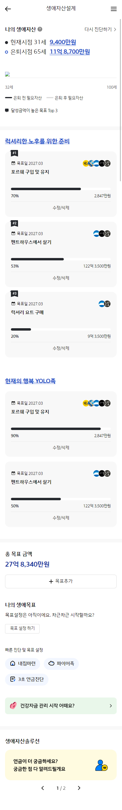

# Portfolio

# 프로필
### 김동희(KIM DONGHEE) 
생년월일 : 1992년 2월 16일  
성별 : 여 
주소 : 서울시 동작구 흑석동 208-2  
연락처 : 010-8538-6646  
E-MAIL : dhk8538@gmail.com
  

# 경력
* 2022.01 ~ 매디브 / uiux팀 과장
* 2021.08 ~ 2021.12 매디브 / 프리랜서
* 2021.05 ~ 2021.07 리앙에이지 / 프리랜서
* 2019.11 ~ 2021.04 리앙에이지 / ui개발팀 대리
* 2019.06 ~ 2019.09 이니셔티브식스 / ui개발팀 대리
* 2017.08 ~ 2018.08 아이엠폼 / 뉴미디어사업팀 대리
* 2017.01 ~ 2017.07 나모웹비즈 / 대리
* 2015.01 ~ 2016.12 위밋 / Dev2팀 사원
* 2013.03 ~ 2014.12 비브이에스 / 제작3팀 사원
* 2012.09 ~ 2013.03 DBK / 프리랜서

  
# 기술
html5 표준 마크업 및 css, sass, scss, jQuery, JavaScript, vue 가능 
크로스브라우징, 반응형 웹, (멀티 디바이스) 작업 가능 
웹접근성 마크 획득 경험 다수 
Git, svn, webpack 사용 소스형상관리 가능  
wiki, jira 협업도구 사용 경험 

  
# 프로젝트  

## KB증권 신규 웹트레딩 서비스 구축  (2023.03~ 2023.08) 
- Web Markup 단위 작업
- Web sub Jquery
  

* * *
## 잡코리아 운영  (2022.11~ 2023.02) 
<figure class="half">

</figure>
- 메인개편
- Web Markup 단위 작업
- Web sub Jquery
  

* * *
## 크리에이츠 사이트 구축 (2022.12 ~ 2022.12) 
<figure class="half">

</figure>

- Web, Mobile Markup 단위 작업
- Web sub Jquery
- 반응형 사이트
  

* * *
## 아모레퍼시픽 브랜드웹 리뉴얼 구축 (INT/CN) (2022.11 ~ 2022.12) 
<figure class="half">

</figure>
- Web Markup 단위 작업
- Web sub Jquery
  

* * *
## LGcns ai튜터 운영 (2022.09 ~ 2022.10) 
<figure class="half">

</figure>

- PL
- 메인 개편
- Web 단위작업
- Web sub Jquery
  

* * *
## LG화학 전시회 키오스크 구축 (2022.09 ~ 2022.10) 
- PL
- Web 단위작업
- Web sub Jquery
  

* * *
## GS 리테일통합 BOS 구축 프로젝트 (2022.04 ~ 2022.08) 
<figure class="half">

</figure>
- Web, Mobile Markup 단위 작업
- Web sub Jquery
- swiper 적용
  

* * *
## 세나클소프트 web EMR 구축 (2022.03 ~ 2022.04) 
- Web Markup 단위 작업
- Web sub Jquery
  

* * *
## LG U 전사 대표 디지털체널 구축 (2022.02 ~ 2022.03) 
<figure class="half">

</figure>
- Web Markup 단위 작업 (모바일요금제, 인터넷 iptv)
- vue 사용 프로젝트
- 접근성
  

* * *
## 교보생명 금융마이데이터 시스템구축 (2021.08 ~ 2021.12) 
<figure class="half">

</figure>
- Web, Mobile Markup 단위 작업
- Web sub Jquery
- 접근성
  

* * *
## KT 커머스 반응형 사이트 구축 (2021.05 ~ 2021.07) 
- Web Markup 단위 작업
- Web sub Jquery
  

* * *
## 이마트 피코크/데이즈 사이트 구축 (2019.11 ~ 2019.03) 
<figure class="half">

</figure>
- Web, Mobile Markup 단위 작업
- Web sub Jquery
- 시멘틱 테그를 이용한 약관 작업
  

* * *
## 우리은행 태블릿 브렌치 고도화 (2020.04 ~ 2020.05) 
- Markup 단위 작업
- Web sub Jquery
  

* * *
## 롯데면세점 운영 (2020.06 ~ 2021.04) 
<figure class="half">

</figure>

- 메인 부분개편
- Web, Mobile 유지보수
- 이벤트 페이지 작업
- BO관리
- 고도화
  

* * *
## 메리츠캐피탈 중고차 대출 구축 (웹, 모발일, 앱) (2019.07 ~ 2019.09) 
<figure class="half">

</figure>

- Web, Mobile 단위작업 (마이페이지, 고객센터 메뉴)
- Web sub Jquery
- slick을 이용한 slide 작업
- 시멘틱 테그를 이용한 약관 작업
  

* * *
## 한화 갤러리아 커뮤니케이션 채널통합 관리자페이지 (2019.06 ~ 2019.07) 
- Markup 단위 작업
  

* * *
## 청와대 홈페이지 운영 (2012. 09 ~ 2018. 08) 
 
- 청와대 홈페이지, 관람 페이지 개편 (PC Web, Mobile Web) 및 운영 
- 시즌별 마이크로사이트 제작 
- 특수크로스브라우징 (IE7, IE8) 
- 접근성 마크획득 

